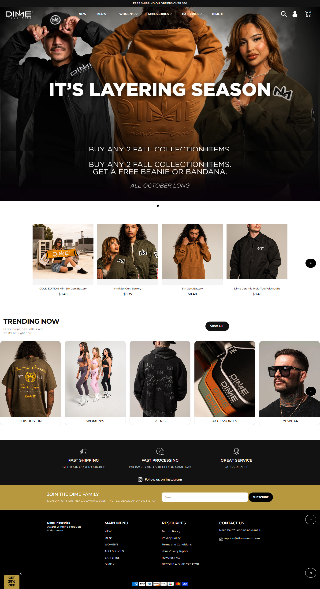

# Dime Merch: Shopify Storefront

Official e-commerce store for Dime Industries, selling branded apparel,
accessories, eyewear, and batteries.

🔗 **Live site:** https://www.dimemerch.com

## Features
- Mega-menu navigation (Men's, Women's, Accessories, Batteries, Dime X collabs)
- "Trending Now" collection grid on the homepage
- Slide-out cart drawer with free-shipping threshold ($50)
- Promo logic: Fall free-gift offer (buy 2, pick a gift) and battery BOGO
- Email signup for giveaways and new drops
- Rewards program and creator program integration
- Apple Pay / Google Pay and major card support

## Tech
- Shopify (Liquid theme: <theme name>)
- <Apps used: e.g. Klaviyo, Grin, rewards app>
- Custom work: <what YOU built, e.g. cart promo logic, collection layouts>

## My role
<Design / theme customization / promo logic / etc.>
